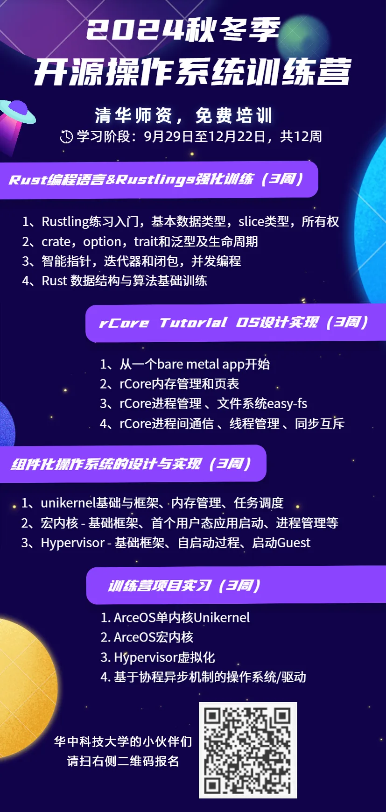

# 2024年秋冬季开源操作系统训练营报名开启

2024年秋冬季开源操作系统训练营报名已开启，旨在培养操作系统领域的技术人才。自2020年由清华大学发起以来，训练营已培养超过5500名学员。本期特色在于专注操作系统内核开发，特别是组件化操作系统方向。训练营将从9月29日持续至12月22日，包括Rust语言编程、RISC-V体系结构、操作系统大实验等课程，并提供实习机会。优秀学员将获得官方证书和奖品。报名截止至9月29日。

训练营详细内容：[2024秋冬季开源操作系统训练营报名开启](https://mp.weixin.qq.com/s?__biz=MzI0OTcwMDk2MQ==&mid=2247484495&idx=1&sn=bd496d6cf835ae3f8bdd5fec16f1891e&scene=21#wechat_redirect)

华中科技大学开源俱乐部将与开源操作系统训练营共同组织线上线下的学习活动，欢迎华中科技大学的小伙伴们踊跃报名。

华中科技大学的同学请扫描下方海报中的二维码报名：

# 微信推文链接

[2024年秋冬季开源操作系统训练营报名开启](https://mp.weixin.qq.com/s/_9aiIxu90xCmsTFIr7w3fg)
