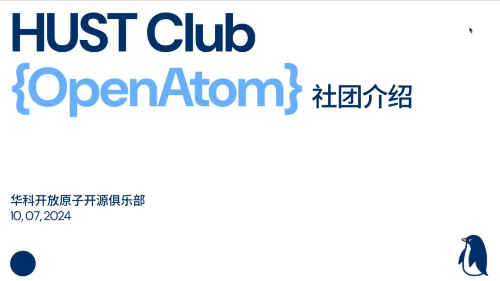

10月7日下午，华科线上宣讲活动第一期在线上成功召开，观看人数累计达 **200+** ，反响热烈。那么本次活动中又有哪些亮点和干货呢？就让我们一起来回顾一下。

## 一、开源操作系统训练营介绍

首先，由清华大学李明老师，为我们介绍本次开源操作系统训练营线下活动的基本情况。他在讲话中特别提到，本次训练营总参加人数已经达到 **3000+** ，这是一个训练营历史上的突破，也说明越来越多的同学开始了解并加入到开源操作系统的领域中来。同时。李老师还以参加过第一期训练营，同时也是本次活动嘉宾的洛佳为例，希望同学们能在训练营中学到技术，提升自我，并最终为开源操作系统做出自己的贡献，也是对广大训练营中的同学们寄予了厚望。

## 二、华科开放原子开源俱乐部简介

本次线上宣讲活动由华科开放原子开源俱乐部主办，由华科开放原子开源俱乐部指导老师慕冬亮老师和俱乐部学生负责人景天一同学，介绍华科开放原子开源俱乐部。

首先，是关于俱乐部负责的一些项目工作。华科开放原子开源俱乐部成立的宗旨是构建自己的开源项目，同时为一些重要的开源项目做贡献。例如，活动演讲嘉宾洛佳所负责的RustSBI正是这些具有代表性的开源项目之一,后续同学们在学习SBI部分时也会看到。

其次，俱乐部还搭建了 **华中科技大学开源镜像网站** ，像华中地区的同学们，就可以将自己使用的Ubuntu等发行版的镜像源设置为华中科技大学开源镜像站。

除此以外，俱乐部还组建了翻译团队HCTT，继承LCTT的意志，专注于翻译Linux方面的技术资讯和杂文，目前也已经收集了**153**篇文章，发布了**42**篇。

除了这些项目工作，俱乐部也有自己的组织活动，包括对外开源活动和校内的 **开源工坊** 。关于对外的开源工作，俱乐部会组织同学们参加开源比赛和大会，同时和武汉Deepin社区也有合作，连续承办了两届的武汉Linux用户组线下沙龙活动（ **WHLUG** )。而校内的开源工坊则是由俱乐部定期举办，并邀请一些核心贡献者来指导同学们针对issue向开源项目提交贡献，是一个帮助同学们实践开源理念的很好的平台。同时华科大开源俱乐部也欢迎来自各大高校同学的积极参与。

**招新微信群**

**俱乐部公众号**

## 三、洛佳《让我们试试RustSBI》

本次活动嘉宾洛佳带来的关于RustSBI的介绍。洛佳回顾了RustSBI四年多的发展历程，提到RustSBI项目孵化自rcore社区，与华科网安学院和rcore社区都有着深厚的历史渊源，在RustSBI项目0.4.0版本即将发布的历史节点，洛佳回顾了RustSBI在四年的发展历程以及主要工作，并对未来进行了展望。洛佳希望Rust、RISC-V 这些新技术能够在产业界上以及教育界的研究上得到更好的发展，给我们未来的和国内的各种各样的架构都提供新的可能性。

洛佳主要从以下四个方面进行了详细介绍：

1. **完整的安全引导解决方案**

首先，洛佳从安全性、功能性和软件生态等多个方面阐述了为何Rust语言被誉为21世纪的编程语言新星。接着，他逐步介绍了RISC-V SBI的概念以及RustSBI项目的背景。随后，他详细讲解了今日RustSBI的架构，主要分为应用层、基础包层和实用软件三个部分。同学们清晰地理解了RustSBI的整体框架和其在RISC-V生态中的重要作用。

接着洛佳重点介绍了RustSBI原型设计系统，该系统已适配了多种发行版（如Ubuntu、Fedora等），并计划在真实硬件上进行测试和定制化开发。

他希望到2026年与国内外芯片厂商及调试设备厂商深化合作，推动裸机开发的开放性，并积极开展无线协议的研究，以增强开源生态的活力，从而获取更广泛的市场应用。

2. **裸机程序、支持平台与生态**

洛佳提出引导程序、嵌入式应用和操作系统共享同一个Rust生态，从而可以构建相互信任的机制，规范生态文档，避免重复开发，达到生态共通共荣。紧接着，他又从执行环境、以SyterKit为例的零阶段引导程序和延长现有硬件寿命等三个方面来进一步解释为何要使用RustSBI，以及当下的引导程序可以实现的一些功能，并由此可见RustSBI项目未来发展的广阔前景。

3. **启动与支持操作系统**

洛佳先是介绍了RISC-V SBI引导标准中的三种启动方式，包括裸SBI启动、LinuxBoot引导程序启动，以及UEFI引导程序启动。然后介绍了如何引导发行版，主要有两条路线，“可移植性”路线和“闭环生态”路线。在操作系统这一部分，他还特别提到了操作系统安全性需求，这也是广大信息安全人才较为关注的一个方面，主要包括可信执行环境、安全引导和快速加解密三个部分。

4. **展望：可信环境与AI系统应用**

在这一部分，洛佳重点为大家介绍了一个正在开发的RustSBI Agent项目,目标定位为开发者的AI助手，其内含大量RustSBI的专业知识，可以为广大开发者节约时间和精力，目前项目也正在调试一些prompt，感兴趣的同学也可以参与进来，积极贡献。

## 四、一些Q&A

Q:可以讲讲虚拟化方面的支持吗？

A(洛佳):关于虚拟化，可以分为一类虚拟化和二类虚拟化。有一种虚拟化支持情况是在用户和系统都启动后再运行软件，这样的软件本身就带有SBI接口；另一种是针对大虚拟机的情况，在上面运行虚拟机，这样虚拟机的虚拟机本身是要有SBI接口的。这两种SBI接口都是需要去支持里面内核的运行。抽象的来看，SBI里面是内核，外面是环境。环境对内核都需要有SBI接口。再就是关于虚拟化项目，虚拟化软件本身有时候就是一个系统应用，这个时候它本身就是要运行在SBI接口上的。RustSBI就可以支持这类软件的运行。

Q:现在RustSBI项目是什么状态？

A(洛佳):RustSBI由20多个子项目组成，它的主仓库是一个library，已经发展了四年左右较为稳定。它的实现主要在其它仓库里，这些仓库涉及到不同技术和不同厂家支持，很多都在活跃开发。后续RustSBI的prototyper可能也会合并到主仓库里。

## 五、结语

本次华科线上宣讲第一期活动已经圆满结束，相信同学们在这次宣讲中也收获颇丰，后续我们还将继续开展一系列的线上宣讲，也希望大家能密切关注、积极参与。

附：[开源操作系统训练营-华科线上宣讲系列活动介绍](http://mp.weixin.qq.com/s?__biz=MzkxMzUzMzIxMw==&mid=2247485106&idx=1&sn=b08aaaf18db2ccd0259bd1f5405fae5d&chksm=c17d76c0f60affd6bde397bd28575b1c5c59a5a21f574eb25ad9b1a8d8bc142cd3f76bb70794&scene=21#wechat_redirect)

宣讲回放：[b站链接](https://www.bilibili.com/video/BV1fL2EYBExb/?vd_source=a93d7420d308f2705579601c043b6e91)

宣讲PPT：可以在华科开放原子俱乐部[官方GitHub账号下载](https://github.com/hust-open-atom-club/docs/tree/master)或者在[网盘下载](https://pan.quark.cn/s/7d15a32aee7c)
