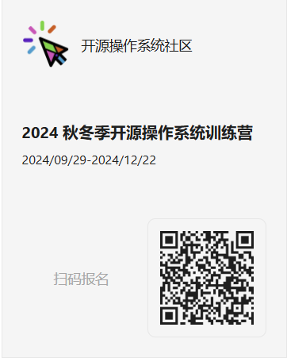
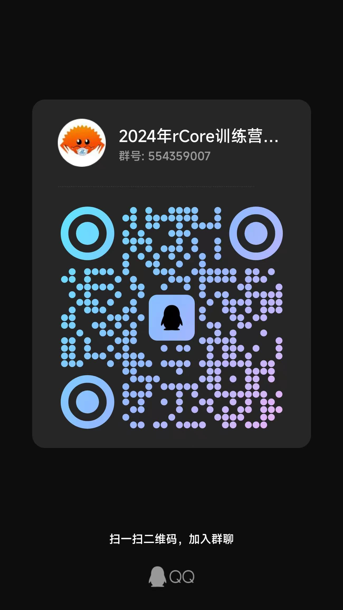
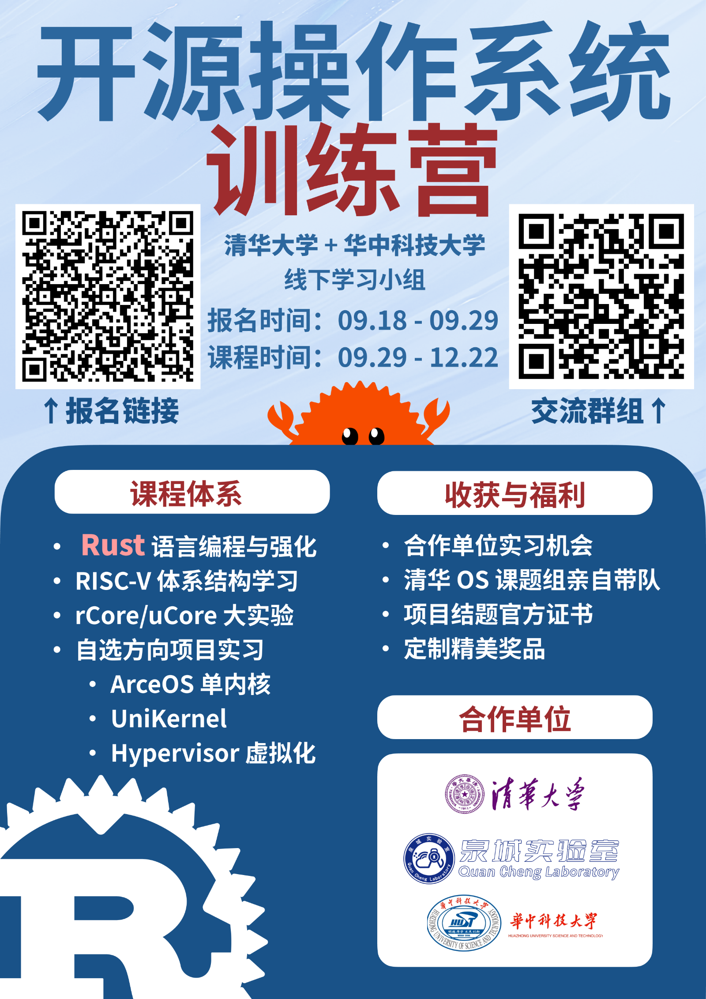

# 线下沙龙：2024年秋冬季开源操作系统训练营报名开启

为了在广大高校中进一步寻找和培养有志于操作系统领域的技术人才，我们华中科技大学开源俱乐部联合清华大学共同发起了2024年秋冬季开源操作系统武汉地区的线下训练营活动。

# 训练营主要内容

本次训练营重点聚焦于操作系统内核开发，特别是组件化操作系统方向，将先后开设包括Rust语言编程、RISC-V体系结构和操作系统大实验在内的一系列课程，并为大家提供实习机会。本次活动的优秀学员也将获得官方证书和奖品。

# 报名时间和开展时间

 **报名时间截止至9月29日。** 本次训练营将从9月29日持续至12月22日，为期十周。

# 你将收获

* **丰富知识：** 对操作系统原理与机制的深入了解
* **实习经历：** 优秀学员将有机会获得优先实习的机会。
* **官方证书：** 获得清华大学操作系统实验室颁发的证书，为你的履历增添光彩。
* **精美奖品：** 优秀者有机会获得开源操作系统训练营专属定制T恤、背包等奖品。

# 报名流程

### step 1:提交报名表

扫描下方二维码立即报名：

### step 2:加入QQ群

扫描下方二维码进群：

训练营详情：[2024秋冬季开源操作系统训练营报名开启](https://mp.weixin.qq.com/s?__biz=MzI0OTcwMDk2MQ==&mid=2247484495&idx=1&sn=bd496d6cf835ae3f8bdd5fec16f1891e&scene=21&token=1890778131&lang=zh_CN#wechat_redirect)

# 欢迎转发/张贴海报

# 微信推文链接

[线下沙龙：2024秋冬季开源操作系统训练营报名开启](https://mp.weixin.qq.com/s/Is6XXpoZ_L4JoY7f7iWoYQ)
