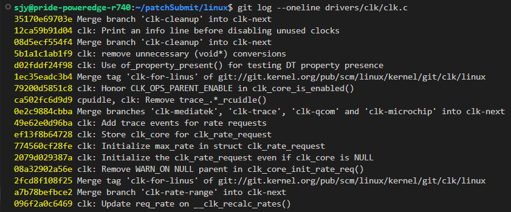
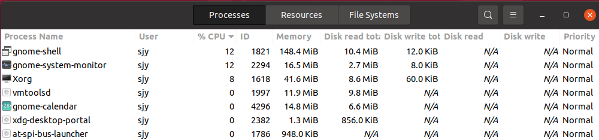

# 内核 Patch FAQ

## **NOTICE**

1. 将文档在浏览器中打开，可以在左侧看到**目录**。
2. 在`git format-patch`生成patch文件以后，使用`./scripts/checkpatch.pl ${PATCH_FILE}`检查patch文件时，**warning是不可忽略的**。
3. 在使用学校的smtp服务器`git send-email`之前，需要首先设置自己的密码，没有默认密码。<div align="center"></div>
4. `git send-email`时出现的很多错误可以用**重发几次**的方法解决。（这里的“很多错误”或许需要大家来补充）
5. <https://docs.kernel.org/process/submitting-patches.html>
6. 可以在<https://groups.google.com/g/hust-os-kernel-patches>查看团队过去发送的 patch。
7. **请在 gitconfig 中将 name 设置成自己的真名**。

## **Issue 修复参考**
### **Missing unwind goto ...**

参考 Dan 的 Blog：内核错误处理规范

<https://staticthinking.wordpress.com/2022/04/28/free-the-last-thing-style/>

### **Xxx is an error pointer or valid**
### **Return from `debugfs_create_dir`**

```bash
Debugfs is kind of weird. The correct thing here is just to delete the
NULL check.

There are some times where a driver will do something weird with the
dir->inode pointer so in that case we need to check for errors. But if
the driver doesn't dereference the dir pointer then we can just delete
the error handling.

The commit message would say:

	[PATCH] wifi: mt7601u: delete dead code checking debugfs returns

	Smatch reports that:
	  drivers/net/wireless/mediatek/mt7601u/debugfs.c:130
	  mt7601u_init_debugfs() warn: 'dir' is an error pointer or valid".

	Debugfs code is not supposed to need error checking so instead of
	changing this to if (IS_ERR()) the correct thing is to just delete
	the dead code.

The other question about this code is when are the debugfs files
deleted? I don't see that happening and it seems like it would lead to
a use after free or something.

Debugfs can only be written to by root and driver unload is a privileged
operation so this is not a security issue but it would be a bug.

regards,
dan carpenter

```

## **Patch 相关常见问题**
### **我应该何时添加 Reviewed-by 标签？**

- 只有当大家看见这样的回复邮件时，你才可以在下一版本的patch中加上reviewed-by tag，否则，贸然加上别人的reviewed-by tag会很不礼貌。<div align="center"></div>

### **Commit Title 前面的 xxx: yyy: 是什么？如何编写合适的 Commit Title？**

- 可以使用`git log --oneline ${FILE}`查看其他人对该文件的commit标题，并仿照他们的标题。<div align="center"></div>

### **我在发送第二版 Patch 时需要注意什么？**

- Change log.

  提交第二（n）版Patch时，需要**在COMMIT MSG后面三个横线下面**写上，最近的change log 写在最上面，格式为：
```
v2 -> v3: ...
v1 -> v2: ...
```
例子为：<div align="center"></div>

- Subject prefix.

  使用[PATCH v2]而不是[PATCH]

### **我的 Patch 在内部审核通过了，在发送给内核 Maintainer 之前需要注意什么？**

1. 准备好通过内部审核的 patch，**删除其中的 changelog 以及版本 subject prefix**
2. 发送 patch 至内核社区，**不要忘记抄送至 HUST OS Kernel Contribution** &lt;<hust-os-kernel-patches@googlegroups.com>&gt;
3. 等待内核维护者的意见，如需要发送 Patch v2，可以在发送给内核社区之前发送到 patch copilot 处（并抄送至 <hust-os-kernel-patches@googlegroups.com>）进行检查
   1. 如果是我们通过静态分析扫描出来的问题，要在 changelog 的位置写清楚，可以是这样的字段：
   ```
   ---
   This issue is found by static analyzer. The patched code has passed
   Smatch checker, but remains untested on / by ... SoC/ real device / concrete running
   ```

### **把 Patch 发送到内核邮件列表之后很长时间没有回复怎么办？**

可以回复“ping？”，但不要发送 PATCH V2 或 PATCH RESEND

### **我的第一版 Patch 存在问题，如何在第一版的基础上生成第二版的`format-patch`？**

- 还没有`git send-email`出去的patch，此时你的Patch依旧是第一版，不需要添加v2之类的信息
  * 如果是对代码的修改有问题，将代码重新修改后，使用`git commit --amend -asev`命令重新提交commit
  * 如果是commit message有误，则直接使用`git commit --amend -asev`命令，修改commit message即可
  * 修改完毕后，`git format-patch -1`即可生成新的patch
- 已经发送出去的patch
  * 第一步和没有发送出去的patch一样，但是在format-patch的时候要指定subject `git format-patch -1 --subject-prefix="PATCH v2"`

### **内核邮件列表中 PATCH 主题的 [PATCH  xx] 都是什么意思？我要怎么使用？**

<div align="center"></div>

为了修改 patch 的前缀，可以使用`--subject-prefix`选项
```
git format-patch -1 --subject-prefix="PATCH v2"
```
生成多个 patch (patch set)
```
$ git format-patch -2 --subject-prefix="PATCH v2"
0001-clk-imx-clk-imx8mp-use-dev_-managed-memory-to-avoid-.patch
0002-clk-imx-clk-imx8mp-add-error-handling-of-of_clk_add_.patch

$ sed -n 4p ./0001-clk-imx-clk-imx8mp-use-dev_-managed-memory-to-avoid-.patch
Subject: [PATCH v2 1/2] clk: imx: clk-imx8mp: use dev_ managed memory to avoid
```

### **我对分配给我的任务感到困难，我应该向谁寻求帮助？**

1. 先问自己啦，参考我们内部的邮件列表中的讨论，由于我们的 issue 大多数是由 smatch 扫描出来的，里面有很多相同类型的问题，也许你的问题就可以在邮件列表里找到答案
2. 参考历史 patch 的写法。用`git blame`看看这个文件的修改历史，或者同一文件夹下其他文件的修改历史，可能可以得到启发
3. 向 Copilot 或直接在群里提问

### **我发现我得到的任务是 False Positive，我应该怎么办？**

可以把问题发到邮件列表里，或者在群里大家一起讨论

### **Patch 中的 Fixes 标签是什么意思？我何时应当添加？要怎么添加？**

1. Fixes: 表示这个Patch修复了一个之前commit引入的问题。这样做是为了更方便地使定位bug的起源，以帮助修复Bug。这个标签同样辅助stable内核团队确定这个patch应该打到那些版本的stable内核上。This is the preferred method for indicating a bug fixed by the patch. See [Describe your changes](https://www.kernel.org/doc/html/latest/process/submitting-patches.html#describe-changes) for more details.
2. 步骤
   1. 首先，如果之前使用`git checkout -b`新建分支，那么在查找Fixes之前需要切换到master分支，参考命令`git switch master`
   2. 使用`git blame {file_path}`查看引入bug代码的commit hash，例如`git blame drivers/clk/imx/clk-imx8mn.c`之后定位到进入代码的行数<div align="center"></div>
   3. 第一列是commit hash的前12位，可以使用命令`git log -p {commit hash} -1`可以打印出指定commit从主分支角度存在的变化差异。其中，-p是打印变化差异，-1是只打印一条commit

      另外可以使用浏览器输入<https://github.com/torvalds/linux/commit/{commit hash}>查看commit内容，效果等同上面命令。**注意：浏览器输入的hash需要是40个字母的hash**

      检查commit内容，<span style="background-color:#e9967a;">**确认commit是否引入了patch修改的bug代码**</span>
   4. 使用`git log --pretty="Fixes: %h (\"%s\")" {commit hash} -1`返回Fixes tag<div align="center"></div>

### **如何编译修改后的内核源代码？**

首先`make allyesconfig`，打开所有的config。

然后`make dir/file.[ois]`（如`make drivers/spi/spi-mux.o`即可编译 drivers/spi/spi-mux.c 文件）。

### **git clone很慢怎么办？**

- 可以使用[中科大的镜像站](https://mirrors.ustc.edu.cn/help/linux.git.html)。<div align="center"></div>
- 使用有线网。如果使用无线网，wireless和auto会比2.4g快。
- 给笔记本插上电，网速也会快些。

### **我的虚拟机很卡怎么办？**

- 有服务器的同学优先使用**服务器**。
- 改为使用wsl2（Windows Subsystem for Linux）。
- [ssh连接虚拟机](https://blog.csdn.net/CSDN_Admin0/article/details/115742048)，不使用图形化界面，可能会快一些。
- 如果仍然打算使用图形化界面的虚拟机，可以在system monitor中查看一下当前瓶颈在哪以及是哪些程序占用了资源，杀掉无关的进程并尝试升级虚拟机配置（处理器、内存等）。
<div align="center"></div>
<div align="center"></div>
<div align="center"></div>