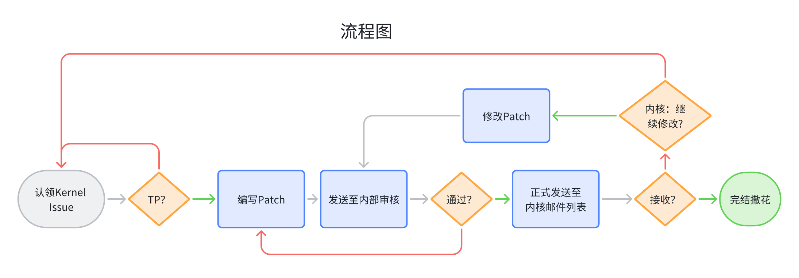

# 传统操作系统内核社区贡献指引

# Linux Kernel

<div align="center"></div>

## 贡献流程指南

1. 认领 Kernel Issue：新入群的同学**请主动联系**内核审核小组分配、或主动认领 kernel issue（详见 [Kernel Issue 认领规则](#kernel-issues-认领规则)）
2. 编写 patch 并进入**内审流程**

   1. **请在 [linux-next](https://git.kernel.org/pub/scm/linux/kernel/git/next/linux-next.git/) 上进行工作！**根据分析工具的报告修改内核代码，按内核社区规范编写 commit message（具体参照[向 linux 社区提交 patch.mp4](./向%20Linux%20社区提交%20Patch%20视频分享链接.md)），生成 patch。请参照 [Patch 编写注意事项](#patch-编写注意事项)。
   2. 生成 patch 后请不要忘记使用 `./scripts/checkpatch.pl` 对 patch 进行检查，**不要忽略任何的警告**。
   3. 请同时对 patch 进行编译测试、以及用 smatch 对对应代码处进行测试（见[内核 Patch FAQ](./Linux%20内核%20Patch%20FAQ.md)），以确保清除明显的问题。
   4. 将 patch 发送给 [HUST OS Kernel Contribution Team](https://ixy0caf7465.feishu.cn/wiki/SyywwBKU5iBzpJkOyk2cMKLin1c?table=tblLaPUiFy2PcMTD&view=vewuEgZ2qW) 中指定的 Patch Copilot 处（详见[内核贡献审核小组成员](#内核贡献审核小组成员)），**并抄送到 HUST OS Kernel Contribution** &lt;<hust-os-kernel-patches@googlegroups.com>&gt;。
   5. 等待内审成员进行审核，此进程中请持续关注邮件列表，内审成员会通过邮件的方式对 patch 提出修改意见
   6. 得到修改意见后，请向内部发送 Patch v2，并在 Patch v2 中添加相应的 changelog
   7. 当 patch 修改至通过内部审核后，会收到来自内部小组的 Reviewed-by 标签，此时可以将该标签添加至最终版 patch 的 commit message 中，准备发送至内核邮件列表。
3. 发送 patch 进入**内核社区审核流程**

   1. 准备好通过内部审核的 patch，**删除其中的 changelog 以及版本 subject prefix**
   2. 发送 patch 至内核社区，**不要忘记抄送至 HUST OS Kernel Contribution** &lt;<hust-os-kernel-patches@googlegroups.com>&gt;
   3. 等待内核维护者的意见，如需要发送 Patch v2，可以在发送给内核社区之前发送到 patch copilot 处（并抄送至 <hust-os-kernel-patches@googlegroups.com>）进行检查

## 讲解视频与讲稿

[向 linux 社区提交 patch.mp4](./向%20Linux%20社区提交%20Patch%20视频分享链接.md)

（讲解视频中与贡献流程不符之处以**贡献流程为准**）

[向 linux 社区提交 patch.pdf](./向%20Linux%20社区提交%20Patch.pdf)

[TM-20211113152610-45723633611-recording-1.mp4](https://ixy0caf7465.feishu.cn/file/XLWYb5HruogUbhxqptEcmHBEnif)

[内核 Patch FAQ](./Linux%20内核%20Patch%20FAQ.md)

## Linux 内核补丁常用命令

```bash
# This file includes bash commands and some config file in slides.
# **DO NOT copy** any code in slides since some characters behaves abnormal in such way.

# Slides Page 3: Clone (Better to choose linux-next repo
git clone https://git.kernel.org/pub/scm/linux/kernel/git/next/linux-next.git
git clone git://10.12.190.56/linux # 实验室本地镜像源，速度快
git clone https://mirrors.ustc.edu.cn/linux.git


# Slides Page 4: New branch
git checkout -b fix

# Slides Page 7: Compile
make allnoconfig
make menuconfig # 会弹出一个菜单界面，可以选择配置。
make -j`nproc`

# Slides Page 8: Commit
git commit -asev
# When commit next time, use amend option
git commit -av --amend

# 注意开启相关的选项并编译，确保自己的代码能通过编译。

# Slides Page 9: Get fixes
git log --pretty="Fixes: %h (\"%s\")" -1 ${BUG_COMMIT_ID}

# Slides Page 12: .gitconfig
[sendemail]
        smtpEncryption = ssl
        smtpServer = mail.hust.edu.cn
        smtpUser = xxx@hust.edu.cn
        smtpServerPort = 465

# Slides Page 13: format-patch
git format-patch -1
git format-patch --subject-prefix="PATCH v2" -1

# Slides Page 17: Check and Get maintainer
./scripts/checkpatch.pl ${PATCH_FILE}
./scripts/get_maintainer.pl ${PATCH_FILE}

# Slides Page 18: Send mail
# Send to internal group
git send-email --to="${YOUR_COPILOT_EMAIL_ADDRESS}" --cc="hust-os-kernel-patches@googlegroups.com" ${PATCH_FILE}

# Send to Kernel Mail List, **do it after reviewed in internal group**
# 这个命令会直接发送到内核邮件列表！！谨慎使用！
git send-email --to-cmd="$(pwd)/scripts/get_maintainer.pl --nogit --nogit-fallback --norolestats --nol" --cc-cmd="$(pwd)/scripts/get_maintainer.pl --nogit --nogit-fallback --norolestats --nom" --cc="hust-os-kernel-patches@googlegroups.com" ${PATCH_FILE}

# 如果想要订阅邮件列表：发送一封空邮件到 hust-os-kernel-patches+subscribe@googlegroups.com
```

## 注意事项

### Patch 编写注意事项

**在生成 Patch 之后：**

- 检查代码中没有额外的空格和 tab
- 检查每一句话句号后（和下一句话之前）留一个空格
- 对于 smatch 检测出的 issue，在 commit message 中注明 smatch 的警告信息
- 大部分情况下，请添加 Fixes 标签（见[内核 Patch FAQ](./Linux%20内核%20Patch%20FAQ.md)）
- 在发送 patch 之前通常需要在 patch 里增加类似这样的说明：

```
---
This issue is found by static analyzer. The patched code has passed
Smatch checker, but remains untested on / by ... SoC/ real device / concrete running.
---
```


- 编写 changelog 的位置与之相同。

## Kernel Issues 认领规则

1. 分派机制（**推荐**）：内核贡献审核小组通过追踪各个 kernel issues 的状态以及认领人员的知识与经验基础（是否成功交过 patch）来进行 kernel issues 分派工作；
2. 认领机制：在 [HUST OS Kernel Contribution Team](https://ixy0caf7465.feishu.cn/wiki/SyywwBKU5iBzpJkOyk2cMKLin1c?table=tblLaPUiFy2PcMTD&view=vewuEgZ2qW) 文档中寻找自己感兴趣的 kenrel issue，向内核贡献审核小组报告并记录在文档中。

## 内核贡献审核小组成员

- 慕冬亮 <dzm91@hust.edu.cn>
- 邹亚龙 <yalongz@hust.edu.cn>
- 程子丘 <chengziqiu@hust.edu.cn>
- 宋静怡 <u201912584@hust.edu.cn>
- 李朝阳 <lizhaoyang04@hust.edu.cn>
- 景天一 <jingfelix@hust.edu.cn>
